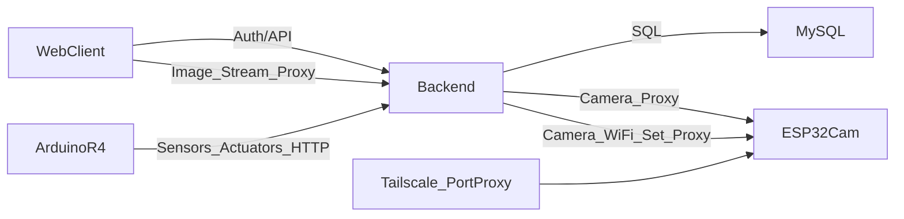

# CES SMART 납품 가이드 (KO)

---

## 대상 독자 / 목표

| 항목 | 내용 |
|------|------|
| **대상 독자** | 신규 인수 담당자, 유지보수 개발자, 시스템 운영자 |
| **목표** | CES_SMART 시스템의 개발/운영/유지보수 인수인계를 1~2일 내에 완료하고, 로컬 개발·서버 운영·하드웨어 연동을 재현 가능한 수준으로 이해 |

---

## 사전 준비물

- [ ] Windows/macOS/Linux 중 하나의 개발 환경
- [ ] Node.js 18+ (권장: LTS)
- [ ] MySQL 8.0+
- [ ] Arduino IDE 2.x 또는 PlatformIO
- [ ] ESP32 보드용 Arduino/PlatformIO 환경
- [ ] Git 클라이언트
- [ ] 텍스트 에디터 또는 IDE (VS Code 권장)

---

## 1. 문서 목적
- 본 문서는 `CES_SMART-main`의 개발/운영/유지보수 인수인계를 위한 통합 안내서입니다.
- 신규 담당자가 코드 구조를 빠르게 이해하고, 로컬 개발/서버 운영/하드웨어 연동을 재현할 수 있도록 작성했습니다.

## 2. 시스템 개요
- 프론트엔드: Next.js + 정적 HTML 혼합 구조
- 백엔드: Node.js/Express + MySQL
- 하드웨어 1: Arduino R4 (센서/릴레이, 주기 전송)
- 하드웨어 2: ESP32-CAM (MJPEG 스트림, WiFi 설정)
- 외부 카메라 접근: 백엔드 카메라 프록시 + Tailscale/포트포워딩 조합

## 3. 인벤토리 요약
- BACKEND 소스: 19 파일 (`backend/**/*.js`)
- FRONTEND 소스: 35 JS + 10 HTML (`frontend/**/*.js`, `frontend/public/**/*.html`)
- ARDUINO 소스: 33 파일 (`arduino-r4/**/*.{ino,h,cpp}`)
- ESP32-CAMERA 소스: 7 파일 (`CES_CAMERA/**/*.{ino,h,cpp}`)

## 4. 핵심 아키텍처


## 5. 문서 읽기 순서
1. `docs/handover/backend_handover_ko.md`
2. `docs/handover/frontend_handover_ko.md`
3. `docs/handover/arduino_handover_ko.md`
4. `docs/handover/esp32_camera_handover_ko.md`
5. `docs/handover/development_transfer_checklist_ko.md`
6. `docs/handover/server_transfer_checklist_ko.md`
7. `docs/handover/commenting_convention_ko.md`

## 6. 빠른 운영 점검
- API 상태: `GET /api/health`
- 카메라 가용성: `GET /api/camera/:moduleId/health`
- 카메라 스트림: `GET /api/camera/:moduleId/stream?token=...`
- 설치 검증: `GET /api/setup/verify`

## 7. 이관 시 가장 중요한 포인트
- 개발 이관
  - Next.js 페이지와 정적 HTML 페이지가 병행되므로 둘 다 수정 대상인지 확인
  - 카메라 경로는 직접 IP 접근이 아니라 백엔드 프록시 사용이 기준
- 서버 이관
  - `backend/.env`와 PM2 설정, CORS origin, 도메인/Nginx, Tailscale 경로를 함께 이전
  - 카메라 네트워크 경로(Tailscale/portproxy) 없으면 외부 스트리밍이 실패

## 8. 운영 리스크 요약
- CORS/PNA 제약: 브라우저에서 로컬 대역 직접 접근 불가, 반드시 서버 프록시 경유
- 토큰 만료: 프론트에서 401 처리 후 재로그인 유도 동작 존재
- 카메라 네트워크 의존: ESP32-CAM URL 자체보다 서버-카메라 간 경로가 중요

---

## 9. 단계별 인수인계 절차

### Step 1: 저장소 및 환경 확인
1. 저장소 클론 또는 압축 해제
   ```bash
   cd c:\KKJ\CES_SMART-main\CES_SMART-main
   ```
2. `backend/.env.example`, `frontend/.env.local.example` 복사 후 `.env`, `.env.local` 생성
3. 문서 읽기 순서대로 `docs/handover/` 내 문서 검토

### Step 2: 백엔드 로컬 기동
```bash
cd backend
npm install
npm start
```
- 정상: `Server running on port 3000` 출력
- 비정상: `DB connection failed` → MySQL 서비스 및 `.env` DB 설정 확인

### Step 3: 프론트엔드 로컬 기동
```bash
cd frontend
npm install
npm run dev
```
- 정상: `http://localhost:3001` 접속 시 로그인 페이지 표시
- 비정상: `NEXT_PUBLIC_API_BASE_URL` 미설정 시 API 호출 실패

### Step 4: Arduino/ESP32 하드웨어 점검
- `arduino-r4/CES_SmartFarm/config.h`: `MODULE_ID`, `API_BASE_URL` 확인
- `CES_CAMERA/config.example.h` 참고해 `config.h` 생성 후 보드 타입/핀 매핑 검증

---

## 10. 검증 방법 (정상/비정상 기준)

| 검증 항목 | 정상 기준 | 비정상 기준 |
|----------|-----------|-------------|
| API 헬스 | `GET /api/health` → `200 {"status":"ok"}` | 500, 연결 거부, 타임아웃 |
| 카메라 헬스 | `GET /api/camera/:moduleId/health` → 200 | 502, 504, 타임아웃 |
| 로그인 | POST /api/auth/login → JWT 토큰 반환 | 401, 500 |
| 모듈 목록 | GET /api/modules (Authorization) → JSON 배열 | 401, 빈 배열(권한 문제) |
| 설치 검증 | `GET /api/setup/verify` → 스크립트 실행 결과 | 404, 500 |

---

## 11. 자주 발생하는 문제와 해결

| 현상 | 원인 | 해결 방법 |
|------|------|----------|
| 로그인 후 바로 401 | JWT_SECRET 불일치 또는 만료 | `.env` JWT_SECRET 통일, 로그아웃 후 재로그인 |
| 카메라 검은 화면/504 | 서버→ESP32 네트워크 끊김 | Tailscale/portproxy, ESP32 IP:81 연결 테스트 |
| CORS 에러 | 요청 Origin이 허용 목록에 없음 | `server.js` CORS_ORIGIN에 해당 Origin 추가 |
| Arduino "Connection failed" | API_BASE_URL 오류 또는 방화벽 | `config.h` URL 확인, 서버 포트 개방 확인 |
| 모듈 목록 빈 배열 | user_id/모듈 소유권 불일치 | DB `modules` 테이블 `user_id` 확인 |

